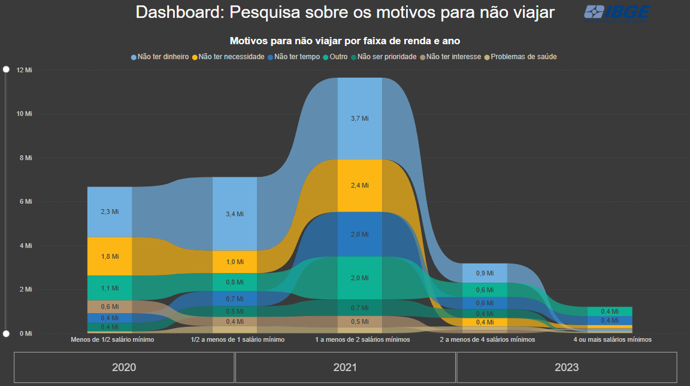

# Dashboard com dados do IBGE
Este projeto consiste em utilizar um dataset da base de dados do IBGE, disponível no site SIDRA. O conjunto de dados escolhido trata de domicílios onde nenhum morador viajou em um determinado período. O objetivo é analisar os motivos que levaram as pessoas a não viajarem e extrair insights a partir dessa análise.
## Etapas
<ol>
  <li><strong>Coleta de dados:</strong> Api do sidra atráves da biblioteca sidrapy</li>
  <li><strong>Tratamento de dados:</strong> Python usando a biblioteca pandas</li>
  <li><strong>Visualização:</strong> Gráfico no Power BI</li>
</ol>

## Ferramentas Utilizadas
<ul>
  <li><strong>Python</strong></li>
  <li><strong>Pandas</strong></li>
  <li><strong>Seaborn</strong></li>
  <li><strong>Sidrapy</strong></li>
  <li><strong>Power BI</strong></li>
</ul>

## Insights extraídos
<ol>
  <li><strong>Motivo financeiro predominante:</strong> "Não ter dinheiro" (azul claro) é o principal motivo para não viajar em todas as faixas de renda, especialmente nas mais baixas.</li>
  <li><strong>Renda mais baixa é mais impactada:</strong> As faixas de menor renda tem a maior quantidade de pessoas que não viajam, reforçando a relação entre renda e possibilidade de viajar.</li>
  <li><strong>Outros fatores relevantes:</strong> Além da falta de dinheiro, "Não ter necessidade" (amarelo) e "Não ter tempo" (azul escuro) são fatores relevantes em diferentes faixas de renda.</li>
  <li><strong>Pico em 2020 / 2021:</strong> O número de pessoas que não viajaram atingiu seu pico nesses anos, possivelmente devido à pandemia da COVID-19, que impactou a economia e a mobilidade.</li>
</ol>

#

## Sobre a criação do dashboard
Como minha intenção é transmitir uma única informação à audiência, optei por um único gráfico grande e bem explicado. Antes de criar um dashboard, considero essencial analisar o público-alvo, pois conhecer quem irá utilizá-lo é fundamental para estruturá-lo de forma adequada.    

No meu caso, como não tenho certeza sobre quem analisará este dashboard, assumi que será um público mais técnico. Por isso, escolhi o gráfico de faixas, que permite uma visão mais detalhada e segmentada dos dados. No entanto, se o público fosse mais leigo, teria optado por um gráfico de barras, que é mais simples e de fácil interpretação.
